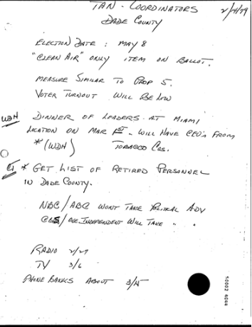
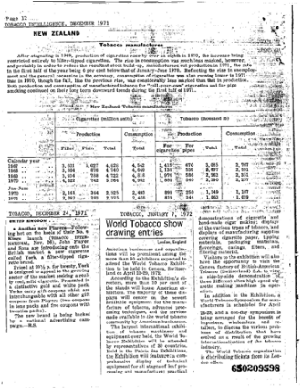
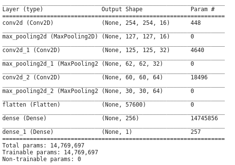
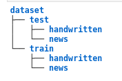
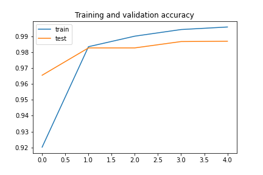
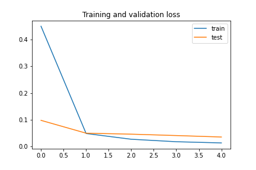
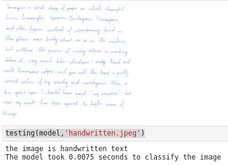
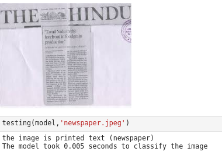

# Binary Classification of Handwritten and Printed Images

A Convolutional Neutal Network was trained on the RVL CDIP dataset, it contains about 16 classes ranging from handwritten images, news clippings, memos and a number of other similar classes, but for this exercise to create a binary classifier, only two classes were taken i.e; handwritten images and news images. News images were taken as it would represent a stark contrast with the handwritten images.

## Table of Contents
1. [**Data Extraction and Exploration**](#data-extraction-and-exploration)
2. [**Model Architecture**](#Model-Architecture)
3. [**Training the Model**](#training-the-model)
4. [**Testing of Model**](#testing-of-model)
5. [**Infereneces and Remarks**](#Inferences-and-Remarks)

## **Data Extraction and Exploration**

The data was in the form of a heirarchy with a truth table, since only two classes were to be used, handwritten and news images were extracted by using the help of the truth table. The extraction of images were done on a local machine and the corresponding extracted dataset was uploaded to a server with a gpu instance of tensorflow for training.

After extraction, about 10000 images were taken for training from each class and about 2500 images were taken for testing from each class, this puts the train, test ratio at about 75 percent.

Shown below is an image from the handwritten class

This is a sample image for the printed text (newspaper) class

 

## **Model Architecture**
#draw a nn using this tool http://alexlenail.me/NN-SVG/LeNet.html

A Convolutional Neural Network was used for the binary classification task of two types of images, as CNNs produce the best results with images, and takes lesser time to train when compared to a standard Neural Network, as there are lesser parameters to train.

The model consists of 3 convolutional layers along with 3 max pooling layers a flatten layer and a hidden layers along with a single neuron to predict. 
- The first convolutional layer has 16 filters and a kernel size of 3x3. It is accompanied by a max pooling layer with a pool size of 2x2, this layer helps with reducing the number of parameters to learn and amount of computation performed in the network.
- The second convolutional layer has 32 filters and a kernel size of 3x3. It is accompanied by a max pooling layer with a pool size of 2x2.
- The third convolutional layer has 64 filters and a kernel size of 3x3. It is accompanied by a max pooling layer with a pool size of 2x2.
- There is a flatten layer after the 3rd max pooling layer to convert the data into a 1-dimensional array to input into the next layer. 
- The Flatten layer is then connected to a fully connected layer with 256 hidden neurons.
- This is then connected to a single neuron with a sigmoid activation function to predict whether or not the image is handwritten or printed text.

## **Training the Model**

### *Dataset Directory*

Keras' image preprocessing library automatically identifies the various classes when it is arranged in test, train folders and each of them have folders corresponding to the classes. The directory used for this project is as shown below

- total training handwritten images:  11032
- total training news images:  10986

- total testing handwritten images:  2500
- total testing news images:  2500

### *Resizing of Images*

The images in the dataset are of the size (1000,754). This resolution is big and would cause longer training times and would increase the size of the model. Hence the size of the images are decreased to a size of (256,256) with the help of the keras image preprocessing library

### *Training*
The Model was trained for 5 epochs with the adam optimizer. The loss function used was the binary crossentropy as it was a binary classification task. The model was trained on a gpu instance of tensorflow and took about **7-10** minutes to train

### *Performance Metrics*
The model accuracy and loss values for both the training and validation sets are:
- model accuracy for training:  99.595 %
- model accuracy for testing/validation:  98.698 %
- model loss for training:  0.0132
- model loss for testing/validation: 0.0353

*Performance Learning Curve*

*Opitmization Learning Curve*

As we can see from the accuracy and loss numbers, the model does not overfit the training data as the delta between the model accuracy for the training set and the validation set is about 1 percent.

#say some more 

## Testing of Model

We test the model by introducing images out of the dataset for the model to classify

*Handwritten image*

*Printed Text (Newspaper) Image*

As we can see, the model correctly classifies the images and takes less than a second to classify, the time to classify will be longer if the model is loaded on a CPU.

## Inferences and Remarks

As seen with the results. The model can classify between handwritten and printed (newspaper) images. There doesn't seem to be a lot of overfitting as indicated by the small delta between the accuracy percentages of the training and validation sets.

Accuracy of 99 percent on the training set and 98 percent on the validation set are good for so few images that the model was trained on, and the model can classify images outside the dataset too.

More images can be added to make the model more robust and to avoid overfitting to only one kind of image (i.e; black and white or images that are in frame). More testing should be done with a variety of images to determine the robustness of the model

